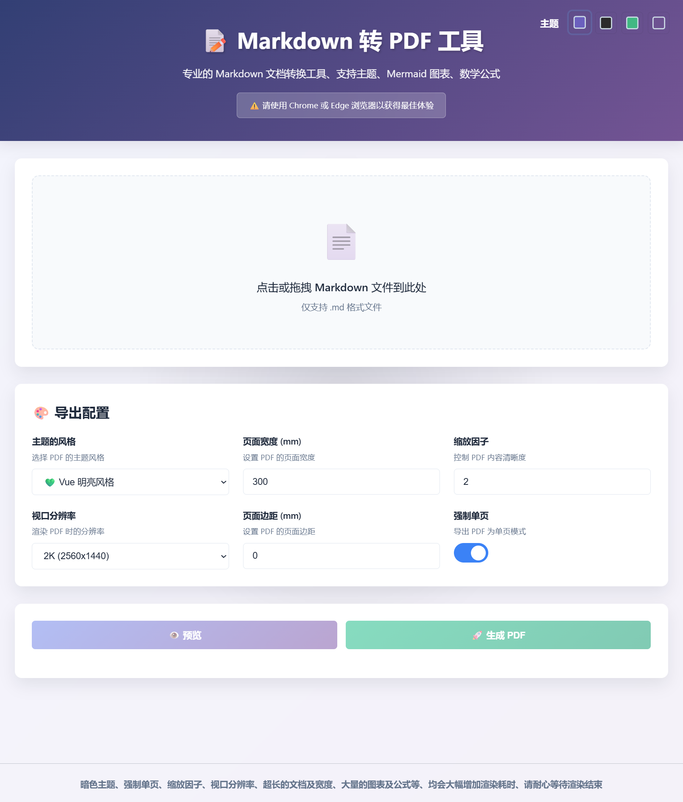

# md2pdf

一个 **基于 Node.js + Headless Chrome（Puppeteer）** 的 Markdown → PDF 转换工具，面向 **工程文档、技术报告、方案说明、归档材料** 等高质量输出场景而设计。



## ✨ 核心特性

### 📄 单页（连续）PDF 输出模式

市面上绝大多数 Markdown → PDF 工具都会：

- 自动分页
- 图表 / 代码块被拦腰截断
- 报告一打印就“翻车”

**md2pdf 提供可选的「单页连续输出模式」**：

- 整个文档渲染为 **一个超长页面**
- 章节、图表、流程图 **完整不中断**
- 特别适合：
  - 技术方案
  - 长报告
  - 展板式 PDF
  - 数字阅读 / 大屏查看

> ⚠️ 提示：单页模式更适合电子阅读，不建议用于纸质打印。

### 🎨 多主题 + 可扩展样式体系

内置多套精心调校的主题，兼顾「可读性」与「审美」：

- `vue` —— 专业、克制，适合技术文档
- `github` —— GitHub 原生 Markdown 风格
- `light` —— 简洁明亮，通用型
- `atom` —— 深色护眼
- `monokai` —— 代码高亮友好
- `solarized` —— 低对比暗色主题

同时支持：

- **自定义 CSS**
- Web 预览主题 & PDF 输出主题保持一致

### 🧩 强大的 Markdown 扩展支持

开箱即用，不玩半成品：

- **流程图 / 时序图**：`mermaid`
- **数学公式**：`MathJax (LaTeX)`
- **代码高亮**：内置样式适配暗 / 亮主题
- **本地图片嵌入**：自动 Base64 内联，PDF 不丢图

## ⚙️ 渲染引擎与输出控制说明

md2pdf 的设计取向非常明确：

> **不 "拼PDF", 而是直接用浏览器画 "PDF"。**

核心组件说明：

- Markdown 解析：`markdown-it`
- 页面渲染：`Puppeteer（Headless Chrome）`
- 输出方式：HTML + CSS → 浏览器排版 → PDF

这意味着：

- 所见即所得
- 可以完整使用 CSS 排版能力
- 对长文档、复杂布局、公式与图表更加友好

### 关于分辨率与缩放因子（deviceScaleFactor）

md2pdf 提供两个对最终输出质量 **影响极大** 的参数：

#### 1️⃣ 分辨率（Viewport Size）

- 常见取值：`1K / 2K / 4K`
- 决定的是：**页面画布的物理尺寸**

#### 2️⃣ 缩放因子（deviceScaleFactor）

`deviceScaleFactor` 等价于浏览器的 **像素密度 / DPI 倍率**：

- 数值越大：
  - 字体、线条、公式越清晰
  - PDF 文件体积越大
- 数值越小：
  - 渲染速度更快
  - 更适合草稿或内部流转

#### 推荐组合（经验值）

| 使用场景        | 分辨率 | scaleFactor |
| --------------- | ------ | ----------- |
| 日常技术文档    | 2K     | 2           |
| 正式交付 / 汇报 | 4K     | 2 ~ 3       |
| 展板 / 大屏展示 | 4K     | 3 ~ 4       |

一句话总结：

> **分辨率决定 "画布有多大", 缩放因子决定 "画得有多细"。**

## 📦 环境要求

- Node.js >= **14**（推荐 **16+ / 18+**）
- npm / pnpm / yarn 均可
- 推荐使用 **本地 Windows Chrome / Edge** 运行

## 🚀 CLI 使用方式（命令行）

```bash
node md2pdf.js [主题名称 | all] [Markdown文件路径]
```

### 查看帮助

```bash
node md2pdf.js --help
```

### 单主题导出

```bash
node md2pdf.js vue ./docs/design.md
```

### 一次性导出所有主题

```bash
node md2pdf.js all ./docs/design.md
```

> 💡 注意: 命令行版本不支持数学公式渲染。

## 🌐 Web 版本（可视化界面）

### 启动服务

```bash
cd md2pdf
npm install
node start
```

### 访问地址

```
http://localhost:80
```

### Web 版能力说明

- 拖拽上传 `.md` 文件
- 在线预览（与 PDF 渲染一致）
- 上传并绑定本地图片
- 可选：
  - 单页 / 分页模式
  - 页面宽度 / 纸张规格
  - 分辨率 / 缩放比例
- 支持 **渲染中取消任务**（服务端强制中断 Puppeteer）

## 📁 项目结构说明

```text
md2pdf
├── md2pdf-cli            # CLI 工具目录
│   ├── md2pdf.js         # CLI 主程序文件
│   └── style             # CLI 使用的主题样式(可自己加主题css文件)
├── public                # Web 公共资源
│   ├── css               # 前端样式文件
│   ├── js                # 前端脚本文件
│   └── libs              # 本地库文件 markdown-it/mermaid/MathJax
├── style                 # PDF 输出主题样式(可自己加主题css文件)
├── server.js             # Web 服务主程序
├── package.json          # 依赖文件
└── README.md             # 项目说明文档
```

## 🪟 Windows 本地运行（强烈推荐）

原因很简单：

- Chrome / Edge 完整可用
- 字体齐全（中英文 / 数学符号）
- Puppeteer 兼容性最好

如果你只是想「把 Markdown 转成好看的 PDF」：

👉 **Windows 本地 = 最省心方案。**

## 🐧 Linux / 服务器部署说明（重点）

>如果需要将项目部署在服务器上供多人使用，推荐使用 Docker 方式部署，详见下文「Docker / 容器化部署」章节。

### 常见问题

- Chromium 安装依赖复杂
- 缺少字体导致：
  - 中文乱码
  - 公式错位
- 无 GPU 加速，渲染性能稍差

## 🐳 Docker / 容器化部署（推荐方案）

### 方案一：直接使用已打包镜像（最快）

```bash
docker run -d --name md2pdf-web --shm-size=4g -p 80:80 md2pdf:web
```

>本方案适合：不想折腾环境，只想开箱即用的用户, 缺点是镜像体积较大, 需要下载 (约4GB的镜像文件)。
>
> 镜像下载地址：https://yw.feihe.com/md2pdf

### 方案二：基于 Gotenberg 自行构建（推荐）

#### 1️⃣ 拉取基础镜像

```bash
docker pull gotenberg/gotenberg:8
```

该镜像已内置 Headless Chrome 及完整渲染依赖。

#### 2️⃣ 准备字体（非常关键）

在 Windows 的 `C:\Windows\Fonts` 目录，找到常用字体，例如:

- 微软雅黑
- Segoe UI
- Segoe UI Emoji
- 等等自己需要的字体

将字体文件打包到 Gotenberg 容器的 `/usr/share/fonts/my-fonts/` 目录下。
如果不知道自己需要哪些字体, 可以直接将整个 `C:\Windows\Fonts` 目录打包复制过去。

```bash
# 然后刷新字体缓存
fc-cache -f -v
```

> ⚠️ 字体缺失是 Linux 下 PDF 渲染问题的 **第一杀手**。

#### 3️⃣ 示例: Dockerfile

```dockerfile
# 基于 Gotenberg 镜像
FROM gotenberg/gotenberg:8

# 安装常用依赖（可选）
RUN apt-get update && apt-get install -y \
    nodejs npm curl vim wget && \
    apt-get clean && rm -rf /var/lib/apt/lists/*

# 拷贝字体文件
COPY my-fonts/ /usr/share/fonts/my-fonts/

# 刷新字体缓存
RUN fc-cache -f -v

# 拷贝项目代码
WORKDIR /root/md2pdf
COPY md2pdf /root/md2pdf

# 安装项目依赖
RUN npm install

# 暴露运行端口
EXPOSE 80

# 启动服务程序
CMD ["npm", "start"]
```

#### 4️⃣ 构建并运行

```bash
# 构建镜像
docker build -t md2pdf:web .

# 运行容器
docker run -d --name md2pdf-web --shm-size=4g -p 8080:80 md2pdf:web
```

### 为什么一定要设置 `--shm-size`

Puppeteer / Chrome 在渲染以下内容时 **极度依赖共享内存**：

- 大尺寸图片
- 单页超长文档
- Mermaid 流程图
- MathJax 数学公式

```bash
# 根据需要调整大小
--shm-size=4g
```

可以显著减少随机崩溃和渲染失败问题。

## 📜 License & Disclaimer

* License：**MIT**
* 免责声明：

> 本项目作者及贡献者不对因使用本工具造成的任何直接或间接损失承担责任。使用即表示你理解并同意该条款。
